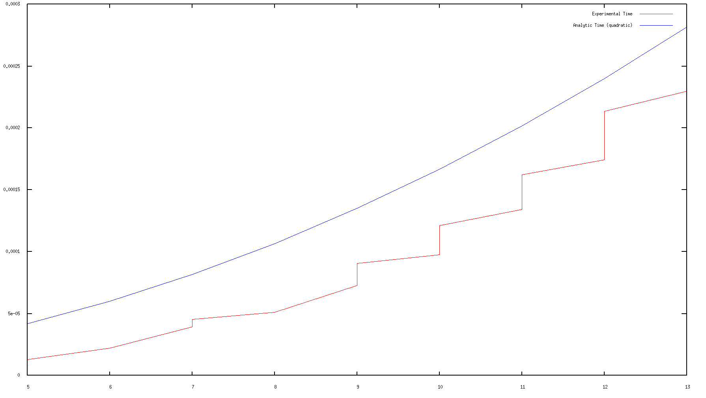
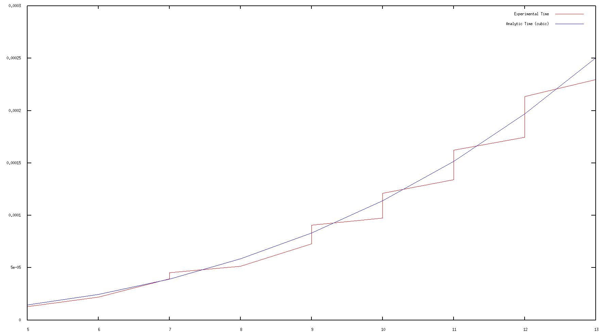

# Duck: The complexity tester

Duck is a library to test the complexity of programs.

The programmer provides one program and one or many complexity
functions that will be hypothesis for the theoretical behavior of the
program. Duck then runs the program multiple times for multiple
instances and compares the theoretical hypothesis with the
experimental data, allowing to determining the complexity closest to the
actual one.

# Examples

The source code comes with 4 example usages of Duck to test and
compare different functions.

## Sort example

The sort example benchmarks three functions:

 - `fastSort`: Haskell's `Data.List` sort applied to `[Int]` -
   Theoretical worst case complexity: O(NlogN);
 - `slowSort`: A custom selection sort applied to `[Int]` -
   Theoretical worst case complexity: O(N^2);
 - `stringSort`: Haskell's `Data.List` sort applied to `[String]` -
   Theoretical worst case complexity: O(NlogN);

The first and second functions test different complexity functions and
the third tests the complexity of a function applied to a compound
object (both the list and each of its elements have dimensions).

A sample result of running this example in a domestic computer (run
with quiet verbosity):

        -- Duck - Complexity Tester --

    Testing sorting algorithms
        fastSort:   haskell default sort
        slowSort:   selection sort
        stringSort: default sort on strings

    Reporting fast with 11% of outside effects (moderately random)
    Reporting slow with 11% of outside effects ( moderately random)
    Reporting string with 12% of outside effects ( moderately random)

    fastSort: linear, linearitmic
    slowSort: quadratic, cubic
    stringSort: linear, linearitmic

The reported complexities are the ones that can be the real ones
(sorted by an arbitrary criterion). To have a better understanding of
the best complexity the user should use different ranges and number of
iterations.

## Search example

The search example benchmarks three functions:

 - `fastSearch`: A search using the `Data.Set` set - Theoretical
   worst case complexity: O(NlogN);
 - `slowSearch`: A search using a linear search in list (randomly
   generated) - Theoretical worst case complexity: O(N^2);
 - `slowSearchWC`: A search using a linear search in list (worst case
   generated) - Theoretical worst case complexity: O(N^2);

The first two functions test functions similar to the *sort
example*. The last one is tested using a default instance of `Cased`
in order to generate only worst case lists (where no element is in the
list).

A sample result of running this example in a domestic computer (run
with quiet verbosity):

        -- Duck - Complexity Tester --

    Testing search algorithms
        fastSearch:   search with haskell Set
        slowSearch:   linear search in list (randomly generated)
        slowSearchWC: linear search in list (worst case generated)

    Reporting fast with 32% of outside effects (very random)
    Reporting slow with 2% of outside effects (not random)
    Reporting slowWC with 8% of outside effects (slightly random)

    fastSearch: linear, linearitmic
    slowSearch: linear, linearitmic
    slowSearchWC: quadratic

Probably due to the distribution of generated cases, the `slowSearch`
example returns a complexity lower than expected. When enforcing worst
case instances, the same algorithm has a different behavior and tests
as a quadratic function.

## Graph example

The graph example benchmarks two functions:

 - `dfs`: A depth first search starting from every node - Theoretical
   worst case complexity: O(V*E);
 - `scc`: Calculating the strongly connected components - Theoretical
   worst case complexity: O(V + E);

These showcase how Duck behaves in more complex input data.

A sample result of running this example in a domestic computer (run
with quiet verbosity):

        -- Duck - Complexity Tester --

    Testing graph algorithms
        dfs:   depth first search from each vertex
        scc:   strongly connected components

    Reporting dfs with 6% of outside effects (slightly random)
    Reporting scc with 6% of outside effects (slightly random)

    dfs: linearitmic
    scc: linearitmic

    dfs individual results
    linear 90%
    quadratic 88%
    scc individual results
    linear 98%
    quadratic 97%

The graph examples are more complicated to test. For starters, there
is a higher variance on the individual test case benchmarks. For this
reason we used a different grouping function (the `maxConf`) for the
group hypothesis test, since `relevant` outputs zero results. Also,
since the complexity depends on both the number of vertices and edges,
some disparities can occur. The end result isn't perfect, but with
more iterations and a better range, it is possible to obtain more
accurate results.

## Matrix example

The matrix example benchmarks a single function:

 - `multiplyNaive`: Naive cubic matrix multiplication - Theoretical
   worst case complexity: O(N^3)

The goal of this example is to show how to get more information out of
a complexity test. Additionally, it shows how to create a particular
type of test cases by instancing the `Cased` class in a particular
way, namely, creating matrices that can be multiplied (their
dimensions must match).

A sample result of running this example in a domestic computer (run
with quiet verbosity):

        -- Duck - Complexity Tester --

    Plotting matrices algorithms
        multiplyNaive: naive cubic matrix multiplication

    Reporting naive with 2% of outside effects (not random)
    naive: cubic, quadratic

Unfortunately, even though the cubic complexity has a greater
confidence, it is impossible to tell if that is statistically
significant. One possibility is to rerun the test with different
bounds and a greater number of iterations or time by iteration, but we
can simply plot the results and check how good they are:

Now it is very easy to see that the complexity that best fits the
experimental data is the cubic one.

# Future work

Duck's benchmarking and statistical treatment can be improved. It is
not easy to clearly distinguish between two close complexity classes,
since both can fit the data with different coefficients. To fight this
effect it is possible to increase the range of instances, however, if
the range is too wide, there are different effects modulating the
final results. For example, garbage collection and memory issues
(cache, ...) can have a greater influence for bigger instances.
